# Гант — руководство пользователя

Версия 1.0. Программу подготовил Averno. Это руководство открывается и в самой программе: «Справка → Руководство пользователя» (Ctrl+F1). Там есть оглавление, поиск и кнопка «Сохранить в PDF».

## Коротко о программе

**Гант** показывает проекты и задания на шкале времени: что и когда должно быть сделано (план), когда делали на самом деле (факт), что просрочено и что идёт сейчас.

- Данные берутся из Excel-отчёта 1С, любой таблицы Excel или CSV, из MS Project или с сервера. Подключение к 1С не обязательно.
- Сроки, статусы и цвета можно поправить прямо на диаграмме. Правки хранятся на вашем компьютере и не пропадают, когда приходит новая выгрузка.
- Результат можно сохранить в Excel, PDF, картинку или файл обмена.

## Установка, обновление и удаление

### Установка

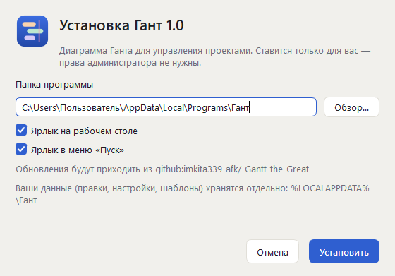

1. Запустите файл `GanttSetup-1.0.0.exe` — его присылает или выкладывает в общую папку тот, кто отвечает за программу.
2. Проверьте папку (по умолчанию `%LOCALAPPDATA%\Programs\Гант`) и нужные ярлыки.
3. Нажмите «Установить», затем «Готово» — программа запустится.

Программа ставится только для вас, права администратора не нужны. Если Windows покажет «Windows защитила ваш компьютер», нажмите «Подробнее → Выполнить в любом случае»: у программы нет платной цифровой подписи.

### Обновление

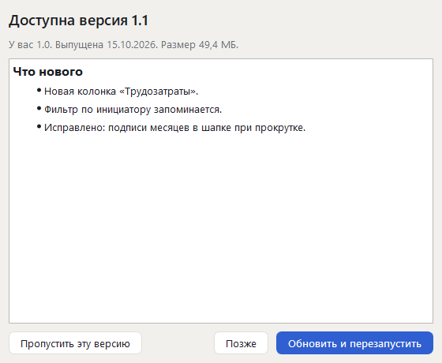

Если источник обновлений задан, программа сама проверяет его при запуске. Когда выходит новая версия, внизу окна появится «Доступна версия…» — нажмите «Подробнее».

1. В окне видно, что изменилось.
2. «Обновить и перезапустить» — программа скачает новую версию, проверит, что файл целый, и перезапустится. Ваши правки и настройки сохранятся.
3. «Позже» — напомнит при следующем запуске. «Пропустить эту версию» — больше не напоминать о ней.

Проверить вручную — «Справка → Проверить обновления…». Если вам прислали файл новой версии — «Справка → Обновить из файла…» и выберите `GanttSetup-*.exe`.

Новые версии программа берёт со страницы выпусков проекта на GitHub. Источник можно поменять на общую папку, адрес сайта или другой репозиторий GitHub (`github:владелец/репозиторий`, можно вставить и ссылку на репозиторий) — обычно это делает установщик. Указать или поменять можно в «Настройки → Обновление программы». Что нового в текущей версии — «Справка → Что нового».

### Удаление

«Параметры Windows → Приложения → Гант → Удалить». Программа спросит, удалить ли и ваши данные: правки, настройки, шаблоны таблиц. Если их оставить, после новой установки всё вернётся.

### Без установки

`Gantt.exe` можно запускать и без установки, например с флешки или из сетевой папки. Правки и настройки всё равно хранятся на этом компьютере.

## Откуда взять данные

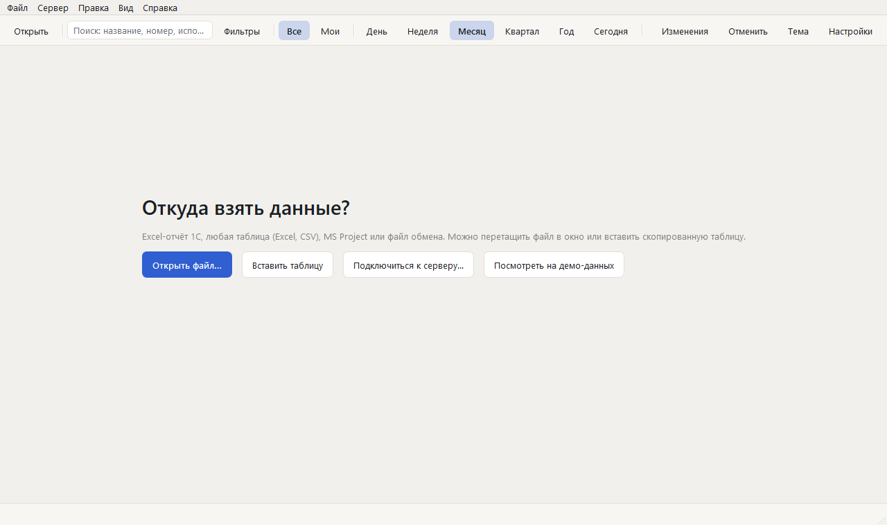

При первом запуске программа спрашивает, откуда взять данные. Позже то же самое — в меню «Файл». Файл можно просто перетащить в окно программы или на её ярлык.

### Отчёт 1С в Excel

Отчёт ProjectsToGanttExport открывается сразу: программа узнаёт его по заголовкам колонок. Статус и процент выполнения она вычисляет сама:

- есть «Дата выполнения» — задание выполнено;
- срок прошёл, а даты выполнения нет — просрочено;
- срок не прошёл — в работе;
- срока нет — задание в работе, его полоса идёт до сегодняшнего дня.

Новую выгрузку открывайте так же. Ваши правки к ней применятся сами. Если данные в отчёте поменялись там же, где вы что-то правили, программа покажет расхождения — кнопка «Разобрать».

### Любая таблица: мастер

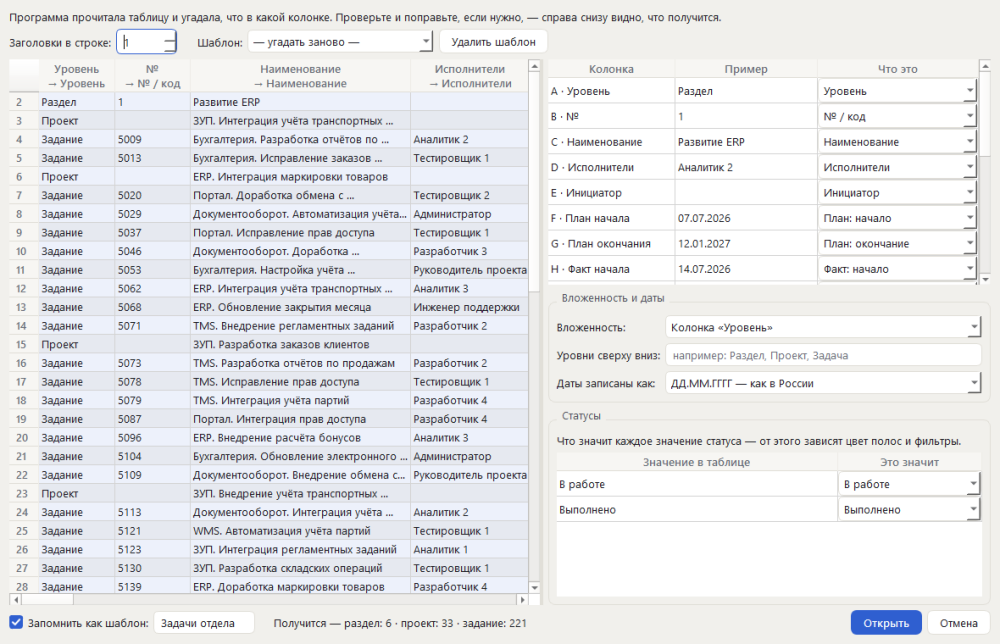

Незнакомую таблицу Excel или CSV программа открывает мастером. Она сама угадывает, что в какой колонке. Вам остаётся проверить три вещи:

1. **«Что это»** у каждой колонки — наименование, исполнитель, даты плана и факта, статус.
2. **Вложенность** — как устроены уровни: колонкой «Уровень», отступами или номерами вида 1.2.3.
3. **Статусы** — что значит каждое значение из таблицы: «В работе», «Выполнено» и так далее. От этого зависят цвета и фильтры.

Внизу видно, что получится: сколько разделов, проектов и заданий. Если отметить «Запомнить как шаблон», такие таблицы дальше будут открываться сразу. Открыть заново через мастер — «Файл → Открыть таблицу через мастер…».

### Таблица из буфера обмена

Выделите строки в Excel вместе с заголовками, скопируйте их (Ctrl+C) и нажмите в программе Ctrl+Shift+V. Откроется тот же мастер.

### MS Project и файл обмена

Файл MS Project (`.xml`) открывается сразу. Файл обмена (`.gantt.json`) — это родной формат программы: в нём сохраняется всё, включая ваши правки.

### Сервер (1С или другая система)

См. раздел «Работа с сервером».

### Демо-данные

«Посмотреть на демо-данных» на стартовом экране открывает выдуманный пример. На нём удобно всё попробовать: ваши настоящие данные это не затронет.

## Окно программы

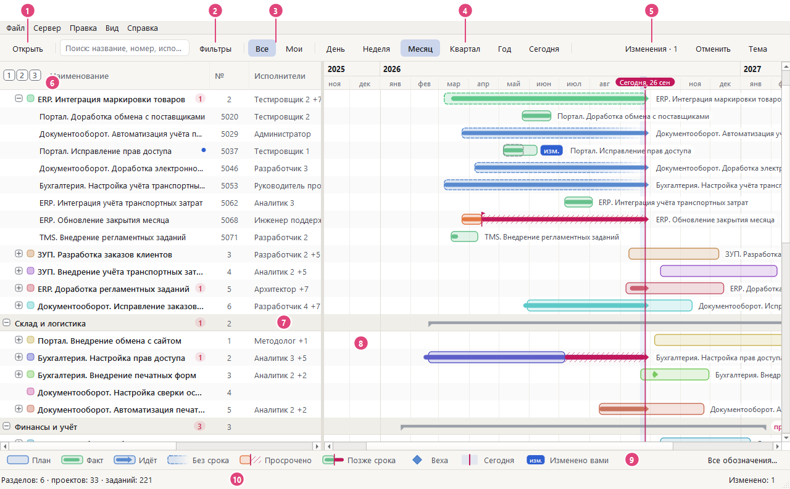

1. **Открыть** — файл с данными. Рядом — поиск по названию, номеру и исполнителю (Ctrl+F).
2. **Фильтры** — какие строки показывать (Ctrl+Shift+F).
3. **Все / Мои** — все задания или только ваши. Кто вы, программа спросит один раз; поменять — «Вид → Кто я…».
4. **Масштаб** — День, Неделя, Месяц, Квартал, Год. «Сегодня» возвращает шкалу к сегодняшнему дню (Ctrl+T).
5. **Изменения** — ваши правки, ещё не отправленные в источник. Рядом «Отменить» (Ctrl+Z), «Тема» и «Настройки».
6. **1 2 3** — показать дерево до нужного уровня: 1 — только разделы, 2 — до проектов, 3 — всё.
7. **Таблица** — разделы, проекты и задания со сворачиванием «+/−».
8. **Шкала** — полосы плана и факта. Строки таблицы и шкалы всегда совпадают.
9. **Строка обозначений** — что значат полосы. «Все обозначения…» (F1) — подробно.
10. **Строка состояния** — сколько всего разделов, проектов и заданий и сколько ваших правок.

Разделитель между таблицей и шкалой можно двигать мышью. При отпускании он прилипает к краю ближайшей колонки.

## Как читать диаграмму

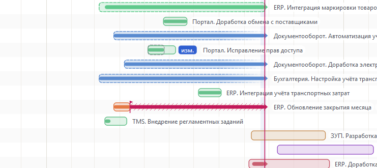

| Что видно | Что значит |
|---|---|
| Светлая дорожка с рамкой | **План**: от начала до срока |
| Насыщенная полоса внутри дорожки | **Факт**: когда делали на самом деле |
| Факт со стрелкой у линии «сегодня» | Задание **идёт сейчас** |
| Дорожка растворяется вправо | **Срок не задан** |
| Красная штриховка от срока до сегодня и «+N дн.» | **Просрочено**: срок прошёл, задание не закрыто |
| Красный хвост факта за красной риской | Закончили **позже срока** |
| Пунктирная рамка у проекта | Своих дат у проекта нет — период собран по его заданиям |
| Серая скобка | Общий период раздела |
| Ромб | **Веха** — событие одного дня |
| Красная вертикальная линия | **Сегодня**; подсвеченная полоса — текущая неделя |
| Метка **«изм.»** у полосы | Строку правили **вы**. Пунктирная рамка вокруг — план до вашей правки |

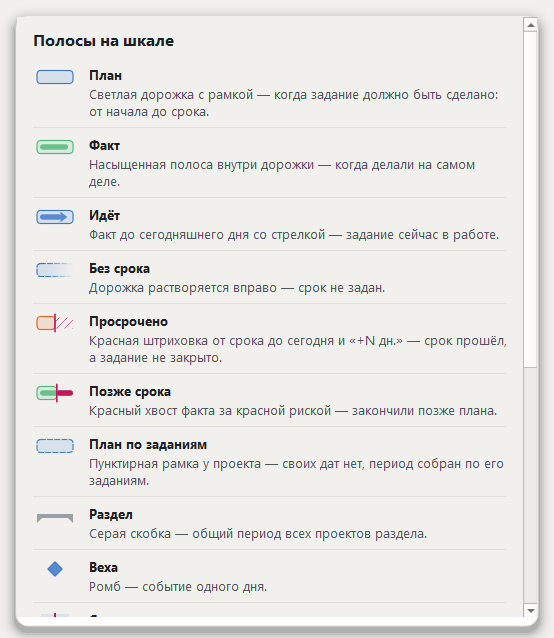

Полное описание с образцами — «Справка → Все обозначения…» (F1).

### Колонка «Срок» и красные числа

В колонке «Срок» написано «через N дн.», «сегодня» или «просрочено N дн.» — красной меткой. У выполненных заданий — «в срок» или «позже на N дн.». Красное число у проекта или раздела показывает, сколько заданий внутри просрочено, даже если строка свёрнута.

### Карточка при наведении

Задержите мышь на строке — появится карточка. В ней описание, план и факт, отклонение от срока, исполнители и ваши правки рядом со значением из источника. Отключить карточку можно в «Вид» или в настройках.

## Перемещение по диаграмме

| Что сделать | Как |
|---|---|
| Прокрутить вверх-вниз | Колесо мыши |
| Прокрутить по времени | Shift + колесо, или полоса прокрутки под шкалой |
| **Потянуть диаграмму в любую сторону** | **Зажать колесо мыши и вести**, как карту в стратегии. Если отпустить на ходу, диаграмма ещё немного прокатится |
| Крупнее / мельче | Ctrl + колесо (масштаб держится вокруг курсора), Ctrl+= / Ctrl+-, кнопки День…Год |
| К сегодняшнему дню | «Сегодня» или Ctrl+T |
| Раскрыть и свернуть | «+/−» у строки, кнопки 1 2 3 в заголовке таблицы, «Вид → Развернуть всё» (Ctrl+Shift+E), «Свернуть до проектов» (Ctrl+Shift+P) |
| Найти | Ctrl+F — поиск по названию, номеру и исполнителю |

Колесо с зажатой кнопкой работает и в таблице: там оно прокручивает список вверх-вниз.

## Фильтры и режимы

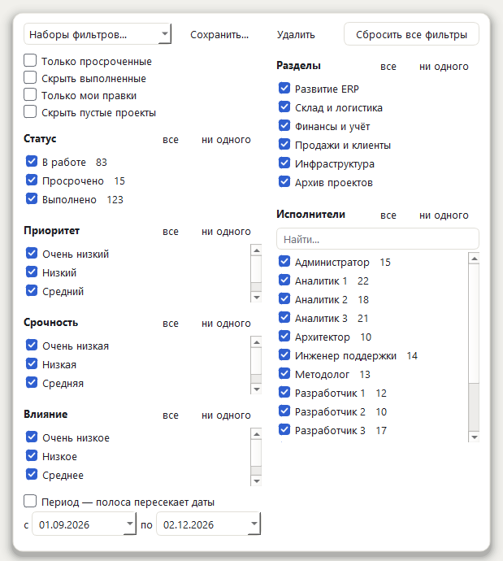

«Фильтры» открываются окном поверх таблицы. Условия складываются:

- разделы, статус, исполнители, приоритет, срочность, влияние;
- период: полоса пересекает выбранные даты;
- «Только просроченные», «Скрыть выполненные», «Только мои правки», «Скрыть пустые проекты».

Удобный набор условий можно сохранить под именем («Сохранить…») и потом выбрать из списка. «Сбросить все фильтры» показывает всё. Окно закрывается щелчком мимо него или клавишей Esc.

**Все / Мои.** В режиме «Мои» видны только ваши задания и их проекты. Это просто вид, а не права доступа.

**Сортировка.** Щёлкните по заголовку колонки. Сортировка идёт внутри каждого уровня. Вернуть исходный порядок — правая кнопка по заголовку → «Порядок как в источнике».

## Колонки таблицы

- **Какие колонки показывать** — правая кнопка по заголовку таблицы. Щелчок по строке списка включает или выключает колонку, меню при этом не закрывается. То же — в «Настройки → Колонки таблицы».
- **Порядок и ширина** — перетащите заголовок или его край.
- **Группа колонок** — Ctrl+щелчок по нескольким заголовкам, затем отпустите Ctrl. Над группой появится скобка с «−»: она сворачивает группу и отдаёт место диаграмме, «+» разворачивает обратно. Разгруппировать можно в меню заголовка.

## Как поправить сроки, статус и цвет

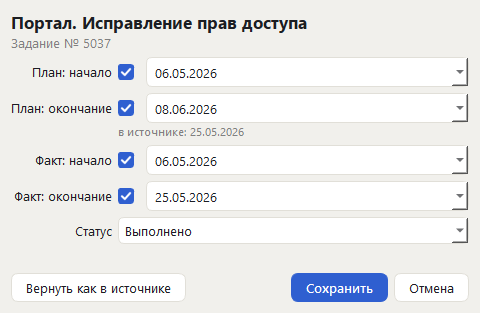

- **Двойной щелчок** по строке или F2 — окно правки: план, факт, статус, цвет проекта. Рядом с каждым полем видно значение из источника.
- **Перетаскивание полосы.** Край полосы меняет начало или срок, середина сдвигает полосу целиком. Даты прилипают к дням, новая дата видна прямо во время перетаскивания.
- **Статус** — двойной щелчок по ячейке статуса или правая кнопка → «Статус».
- **Цвет проекта** — правая кнопка → «Цвет проекта». Цвета названы словами: «Персиковый», «Лавандовый» и так далее.
- **Правая кнопка** по строке также даёт «Вернуть как в источнике», «Развернуть всё внутри» и «Открыть в источнике», если источник дал ссылку.

Отменить — Ctrl+Z, повторить — Ctrl+Y. Поля, которые источник запретил менять, недоступны.

### Где видны ваши правки

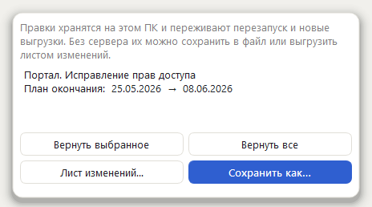

- На шкале — метка «изм.», в таблице — точка у названия.
- Кнопка «Изменения · N» открывает список «было → стало». Правку можно отменить по одной или все сразу.
- Правки хранятся на этом компьютере. Они переживают перезапуск и новые выгрузки отчёта.

Как передать правки дальше:

- **есть сервер** — «Сервер → Отправить правки в источник…», затем «Подтвердить»;
- **сервера нет** — «Сохранить как…» в нужном формате, «Файл → Лист изменений (Excel, PDF)» для согласования или «Выгрузить правки файлом обмена».

## Сохранение и печать

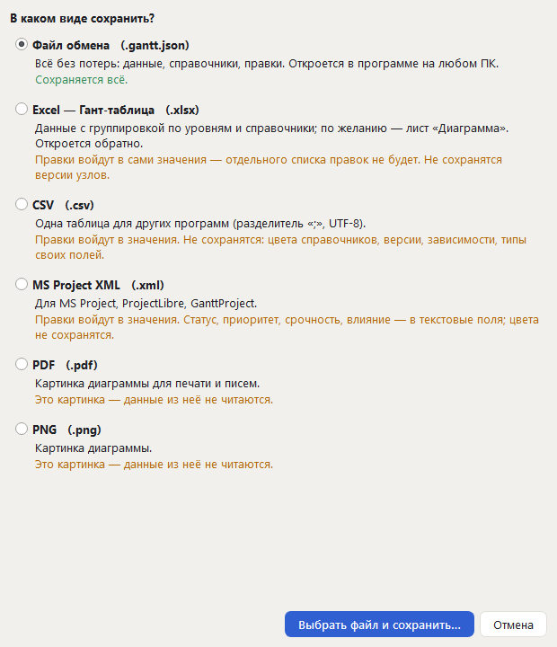

«Файл → Сохранить как…» (Ctrl+Shift+S). Формат выбирается в окне, и для каждого сказано, что в нём не сохранится.

| Формат | Для чего | Что учесть |
|---|---|---|
| Файл обмена (`.gantt.json`) | Передать в программу на другом ПК | Сохраняется всё, без потерь |
| Excel — Гант-таблица | Работать в Excel; по желанию лист «Диаграмма» | Правки войдут в сами значения |
| CSV | Для других программ | Одна таблица, без цветов |
| MS Project XML | MS Project, ProjectLibre, GanttProject | Статусы — в текстовые поля |
| PDF | Печать и письма; A4 или A3, по листам | Это картинка |
| PNG | Картинка для презентации | Это картинка |

Для PDF и PNG можно выбрать строки (как на экране или всё), период и заголовок. Всё, что программа сохранила в Excel, CSV или MS Project, она потом откроет обратно.

## Работа с сервером

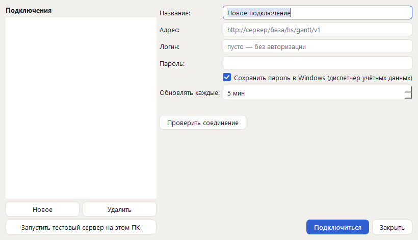

Сервер — это 1С или любая другая система, которая отдаёт данные по открытому HTTP-контракту программы.

1. «Сервер → Подключение к серверу…» → «Новое»: название, адрес, логин и пароль.
2. «Проверить соединение» → «Подключиться».

- Пароль хранится в диспетчере учётных данных Windows, а не в файлах программы. Если не отмечать «Сохранить пароль», программа забудет его при закрытии.
- Данные обновляются сами с выбранным интервалом. Обновить сразу — F5.
- Правки уходят в источник **только** после «Сервер → Отправить правки в источник…» и кнопки «Подтвердить».
- Без связи программа работает с последней полученной копией и сама пробует подключиться снова.
- «Запустить тестовый сервер на этом ПК» позволяет потренироваться без настоящего сервера.

## Настройка под себя

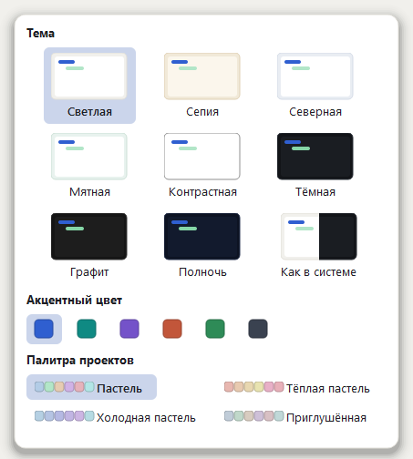

«Тема» — светлые и тёмные темы, акцентный цвет и палитра проектов. Переход плавный, выбор запоминается.

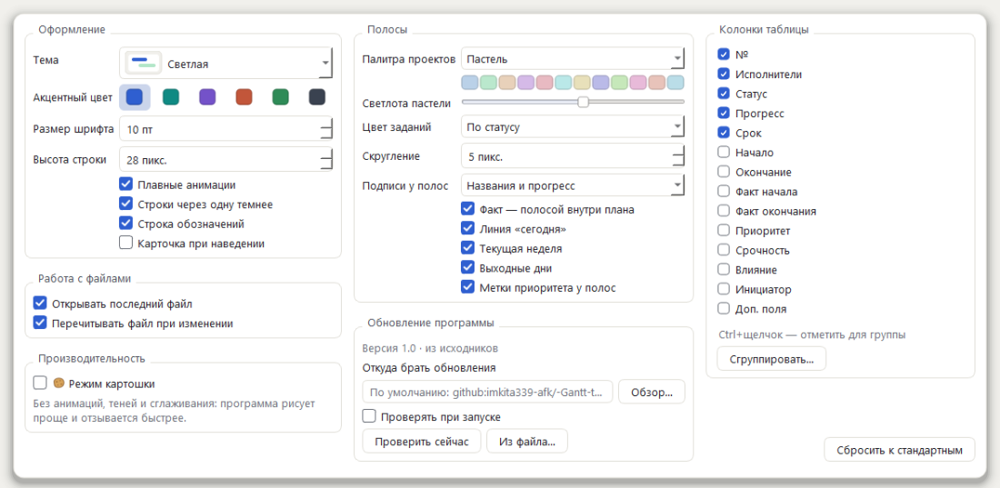

«Настройки» (Ctrl+,):

- **Оформление** — размер шрифта, высота строки, анимации, строки через одну, строка обозначений, карточка при наведении.
- **Полосы** — палитра и светлота цветов проектов, цвет заданий (по статусу или цветом проекта), скругление, подписи у полос, факт, линия «сегодня», текущая неделя, выходные, метки приоритета.
- **Работа с файлами** — открывать последний файл при запуске, перечитывать файл, когда он меняется.
- **Производительность** — режим картошки.
- **Обновление программы** — откуда брать новые версии программы и проверять ли их при запуске.
- **Колонки таблицы** — какие показывать и как сгруппировать.

«Сбросить к стандартным» возвращает оформление. Источник обновлений при этом не меняется.

### Режим картошки

Для слабых компьютеров и удалённого рабочего стола. В этом режиме нет анимаций, теней, скруглений и сглаживания, поэтому окно рисуется проще и быстрее отзывается. Включить можно в «Настройки → Производительность» или «Вид → Режим картошки». Пока режим включён, в правом нижнем углу виден значок-картошка; щелчок по нему выключает режим.

## Горячие клавиши

| Клавиши | Действие |
|---|---|
| Ctrl+O | Открыть файл |
| Ctrl+Shift+V | Вставить таблицу из буфера |
| Ctrl+Shift+S | Сохранить как… |
| Ctrl+F | Поиск |
| Ctrl+Shift+F | Фильтры |
| Ctrl+T | К сегодняшнему дню |
| Ctrl+колесо, Ctrl+= / Ctrl+- | Масштаб крупнее / мельче |
| Shift+колесо | Прокрутка по времени |
| Зажатое колесо мыши | Тянуть диаграмму в любую сторону |
| Ctrl+Shift+E | Развернуть всё |
| Ctrl+Shift+P | Свернуть до проектов |
| Ctrl+Shift+C | Свернуть всё |
| F2 или Enter | Изменить выбранную строку |
| Ctrl+Z / Ctrl+Y | Отменить / повторить |
| F5 | Обновить с сервера |
| Ctrl+Shift+Enter | Отправить правки в источник |
| Ctrl+, | Настройки |
| F1 | Все обозначения |
| Ctrl+F1 | Это руководство |
| Esc | Закрыть всплывающее окно |

## Частые вопросы

**Программа тормозит.** Включите «Режим картошки» («Вид → Режим картошки»). Ещё помогает свернуть лишнее кнопками 1 2 3 и отфильтровать строки.

**Файл не открывается или колонки перепутаны.** «Файл → Открыть таблицу через мастер…» и проверьте, что в какой колонке.

**Пропали мои правки?** Правки привязаны к набору данных: откройте ту же выгрузку, и они вернутся. У отчёта 1С имя файла не важно, подойдёт любая новая выгрузка. Все правки перечислены в «Изменения».

**Как перенести всё на другой компьютер?** «Сохранить как… → Файл обмена». Он содержит данные и правки. Настройки вида хранятся на каждом компьютере свои.

**Где программа хранит данные?** В `%LOCALAPPDATA%\Гант`: правки (`data.sqlite`), настройки (`settings.ini`), шаблоны таблиц, подключения без паролей и копии данных с сервера. Пароли — только в диспетчере учётных данных Windows.

**Вторая копия программы не открывается.** Так и задумано: программа открыта одна, а файл, который вы открываете повторно, передаётся в уже открытое окно.

## Для администратора

### Установка на много компьютеров

Установщик понимает ключи командной строки:

```
GanttSetup-1.0.0.exe --install --silent
GanttSetup-1.0.0.exe --install --silent --dir "D:\Программы\Гант" --no-desktop --update-source "\\server\soft\Гант"
Gantt.exe --uninstall --silent --remove-data
```

- `--silent` — без окон, результат в коде возврата (0 — успешно).
- `--dir` — папка установки. По умолчанию `%LOCALAPPDATA%\Programs\Гант`.
- `--no-desktop`, `--no-start-menu` — без ярлыков.
- `--update-source` — откуда брать обновления. Если установщик лежит в папке, где есть `latest.json`, эта папка запоминается сама.
- `--remove-data` — при удалении стереть и данные пользователя.

### Как выпустить обновление

1. Поднимите номер версии в `gantt/__init__.py` и допишите раздел в `docs/changes.md`.
2. Соберите программу: `.venv\Scripts\python tools\build_exe.py`.
3. Скопируйте содержимое `dist\update` (`latest.json` и `GanttSetup-<версия>.exe`) в источник обновлений: общую папку или каталог сайта.

При следующем запуске программы у всех появится «Доступна версия…». `latest.json` описывает версию, файл, его размер и контрольную сумму, а также что нового. Скачанный файл программа проверяет по этой сумме.

### Обновления с GitHub

Вместо общей папки новые версии можно выкладывать в выпуски (Releases) репозитория на GitHub. Репозиторий должен быть **открытым**: из закрытого программы скачать выпуск не смогут. Если код открывать не хочется, заведите отдельный открытый репозиторий только для выпусков.

1. Соберите программу: `.venv\Scripts\python tools\build_exe.py`.
2. Выложите выпуск — одним из двух способов:
   - командой: `set GITHUB_TOKEN=<токен>`, затем `.venv\Scripts\python tools\publish_github.py владелец/репозиторий`. Нужен токен с правом «Contents: read and write» на этот репозиторий; он берётся только из переменной и никуда не записывается;
   - на сайте: `.venv\Scripts\python tools\publish_github.py владелец/репозиторий --prepare`, затем на GitHub «Releases → Draft a new release», тег `v<версия>`, приложите из `dist\github` сначала установщик, потом `latest.json` и нажмите «Publish release».
3. Источник по умолчанию — `UPDATE_SOURCE` в `gantt/__init__.py`, сейчас это репозиторий проекта `github:imkita339-afk/-Gantt-the-Great`. Другой источник можно указать в «Настройки → Обновление программы» или ключом установщика `--update-source`.

Программа читает `latest.json` по постоянной ссылке GitHub на последний выпуск. Это не API GitHub, поэтому лимита на число проверок нет. Нужен доступ к `github.com` и `release-assets.githubusercontent.com`. Прокси из настроек Windows программа использует сама, но прокси с вводом пароля не поддерживается.
